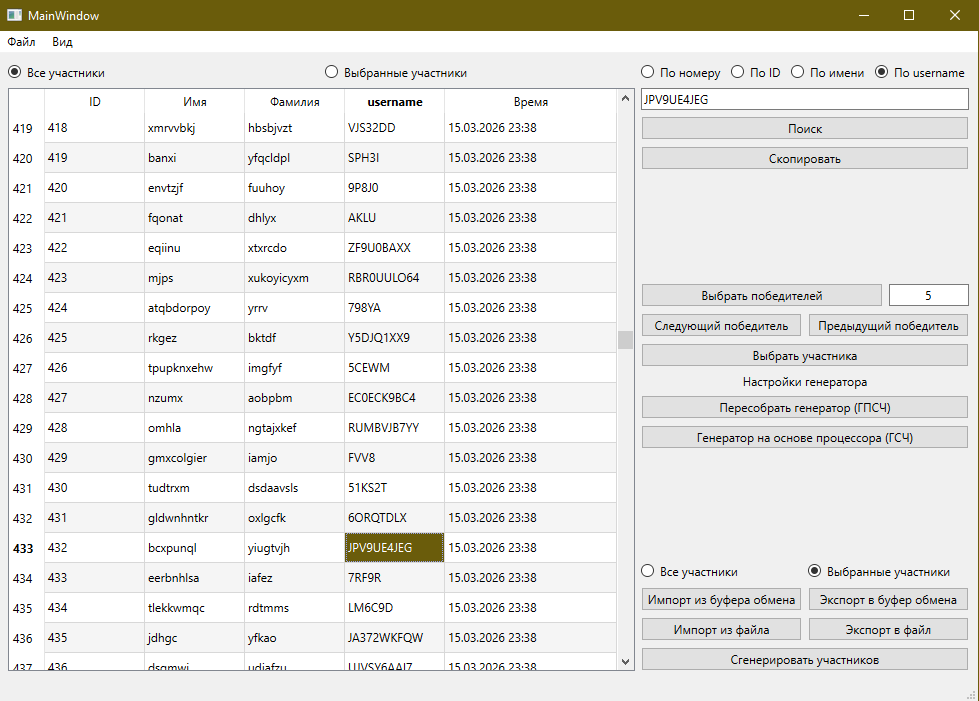

# LotteryEngine

Qt 6 / C++ desktop application for Windows.

## Features
- Importing participants from the clipboard or directly from a file
- Automatic data structuring
- Fast copying of individual fields or entire participants
- Choosing any number of winners without repeats

## Build
```bash
cmake -S . -B build
cmake --build build --config Release
```

## Screenshot


## Download
Windows portable version is available in Releases.

Built with Qt Widgets and CMake.
